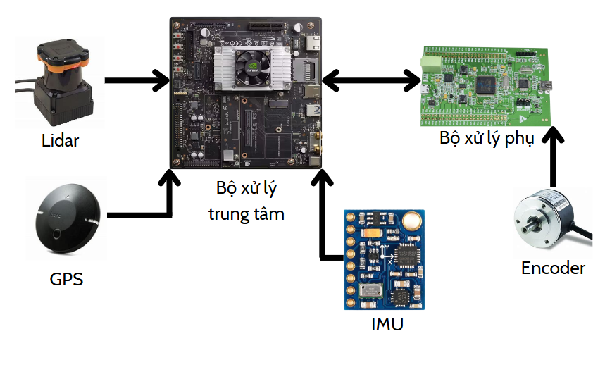
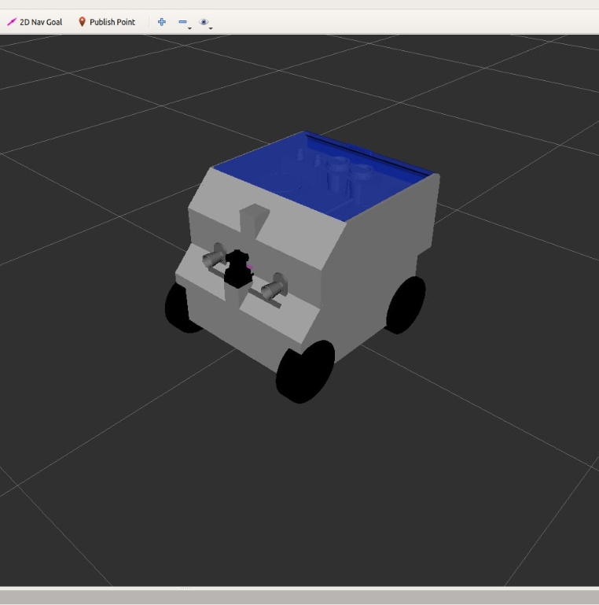
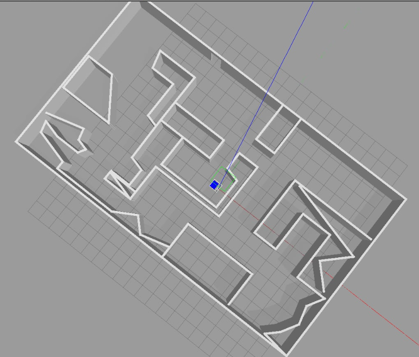
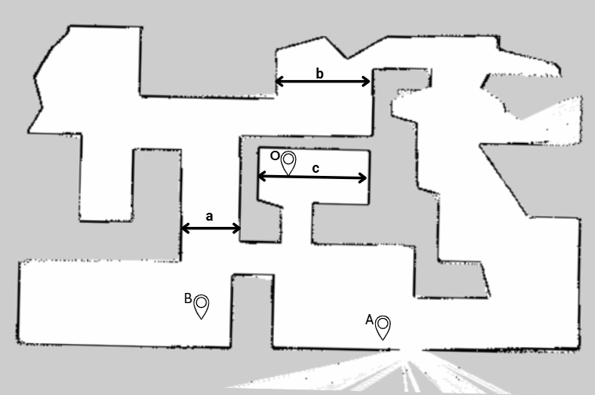
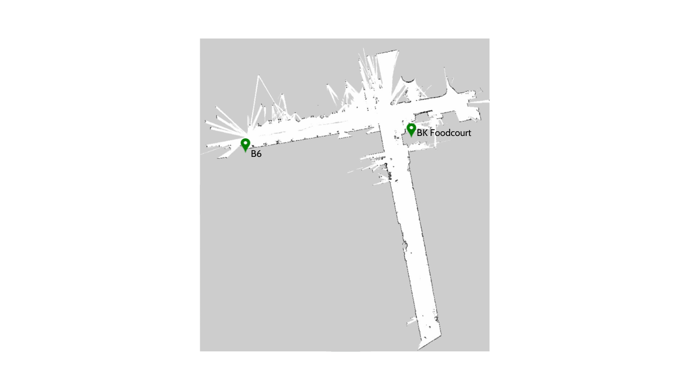
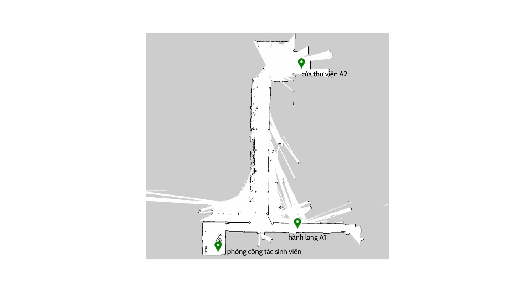
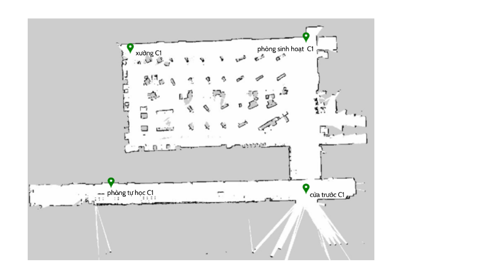

CÁC THÀNH PHẦN TRONG HỆ THỐNG

Hệ thống được xây dựng để phục vụ bài toán **SLAM** (Simultaneous Localization and Mapping) trên nền tảng **ROS**, kết hợp nhiều cảm biến và bộ xử lý để đảm bảo khả năng định vị và tạo bản đồ chính xác cho xe tự hành trong khuôn viên trường Đại học Bách Khoa.

  

---

### 💻 1. Bộ Xử Lý Trung Tâm (Main Processor)
- Nhận tín hiệu từ các cảm biến thông qua các giao thức như **UART** và **I2C**.  
- Sử dụng **máy tính nhúng** (ví dụ: *Raspberry Pi*, *Jetson Nano*) làm bộ xử lý chính.  
- Tích hợp **ROS** (Robot Operating System) để:
  - Thu thập, xử lý và đồng bộ dữ liệu cảm biến.  
  - Tạo các **node** riêng cho từng chức năng.  
  - Truyền và nhận dữ liệu qua **topic** để đảm bảo tính mô-đun và linh hoạt trong giao tiếp giữa các phần của hệ thống.  

---

### ⚙️ 2. Bộ Xử Lý Phụ (Sub Controller)
- Đảm nhiệm điều khiển **driver động cơ** cho hệ thống xe.  
- Đọc dữ liệu **encoder** và gửi về bộ xử lý chính qua giao thức **UART**.  
- Thường được triển khai bằng **vi điều khiển** như *Arduino* hoặc *STM32*.  
- Kết hợp cùng dữ liệu từ **IMU** để hỗ trợ tính toán vị trí và hướng di chuyển của AGV.

---

### 🌐 3. LiDAR
- Cảm biến chính để thu thập dữ liệu môi trường xung quanh.  
- Sử dụng **tia laser** để đo khoảng cách đến các vật thể, tạo ra **PointCloud** — tập hợp các điểm 3D `(x, y, z)` phản ánh cấu trúc môi trường.  
- Dữ liệu LiDAR được gửi lên topic ROS và sử dụng trong **Cartographer** để tạo bản đồ 2D/3D chính xác.

---

### 🧭 4. IMU (Inertial Measurement Unit)
- Cung cấp thông tin về **vận tốc góc**, **gia tốc**, và **hướng quay**.  
- Giúp phát hiện chuyển động tức thời, hỗ trợ việc dự đoán vị trí giữa các lần quét LiDAR.  
- Dữ liệu IMU được lọc qua **Kalman Filter** để giảm nhiễu và tăng độ tin cậy.  

---

### 📡 5. GPS (Global Positioning System)
- Cung cấp thông tin vị trí toàn cục (Latitude, Longitude, Altitude).  
- Dữ liệu GPS được chuyển đổi sang hệ tọa độ phẳng `(x, y)` thông qua điểm tham chiếu (`ref_lat`, `ref_lon`).  
- Sử dụng chủ yếu cho bài toán **định vị ngoài trời**.  

---

### ⚙️ 6. Encoder
- Đo **vận tốc quay bánh xe** và **quãng đường di chuyển** của AGV.  
- Dữ liệu được gửi qua **UART** đến bộ xử lý chính.  
- Khi kết hợp với **IMU**, hệ thống có thể ước lượng vị trí chính xác hơn trong môi trường **trong nhà (Indoor SLAM)**.

---

KẾT QUẢ THỰC NGHIỆM VÀ MÔ PHỎNG

Phần này trình bày kết quả mô phỏng và thực nghiệm trong quá trình nghiên cứu **hệ thống định vị và lập bản đồ (SLAM)** cho xe tự hành trong khuôn viên Đại học Bách Khoa.  
Các thí nghiệm được thực hiện trên nền **ROS Melodic** và **Gazebo Simulation**, sử dụng các cảm biến chính gồm **LiDAR Hokuyo UTM-30LX** và **camera đo độ sâu Kinect**.

---

### 🧪 1. Kết Quả Mô Phỏng Camera3D + Lidar

#### ⚙️ Mô Hình Hệ Thống

  

  

Xe mô phỏng có kích thước **0.45 × 0.45 × 0.5 m**, trang bị:
- **LiDAR** (tọa độ: 0.13, 0, 0.23 m)  
- **Depth camera** (tọa độ: 0.145, 0, 0.3 m)  

Hai cảm biến được đồng bộ hóa theo thời gian và quy đổi về cùng hệ tọa độ `base_link` thông qua **ma trận biến đổi đồng nhất 4x4 (Homogeneous Transformation Matrix)**.

---

#### 🧩 Phương Pháp Gộp Dữ Liệu PointCloud
Dữ liệu từ LiDAR (2D PointCloud) và camera Kinect (3D PointCloud) được đồng bộ và hợp nhất bằng các thuật toán:
- **ICP (Iterative Closest Point)**  
- **GICP (Generalized ICP)**  
- **NDT (Normal Distributions Transform)**  

**Đánh giá chất lượng bản đồ:**

| Thuật toán | Overlap (%) | Mean Deviation (m) |
|-------------|--------------|--------------------|
| ICP | 85.1 | 0.105 |
| GICP | 88.4 | 0.098 |
| **NDT** | **96.1** | **0.067** |

> ✅ **Kết luận:** Thuật toán NDT đạt kết quả tốt nhất với độ khớp 96.1% và sai lệch trung bình chỉ 0.067 m.

---

#### 🗺️ Bản Đồ 2D Sau Khi Quét

  

| Đoạn | Kích thước thực tế (m) | Kích thước bản đồ (m) | Sai số (%) |
|-------|--------------------------|------------------------|-------------|
| a | 3.00 | 3.03 | 1.00 |
| b | 4.75 | 4.79 | 0.84 |
| c | 4.25 | 4.19 | -1.41 |

#### 📍 Kết Quả Định Vị Trong Mô Phỏng (AMCL)
| Điểm | Tọa độ X (m) | Tọa độ Y (m) |
|-------|---------------|---------------|
| O | 0.002 | -0.001 |
| A | -4.365 | 6.595 |
| B | 6.806 | 5.649 |

> Việc sử dụng **AMCL** giúp xe xác định vị trí ổn định và tái định vị nhanh khi mất tín hiệu cảm biến.

---

### 🧪 2. Kết Quả Mô Phỏng chỉ dùng Lidar

Thông số xe như cũ

  

| Đoạn | Kích thước thực tế (m) | Kích thước bản đồ (m) | Sai số (%) |
|------|--------------------------|------------------------|-------------|
| a | 4.75 | 4.78 | 0.63 |
| b | 2.98 | 3.02 | 1.32 |
| c | 2.04 | 2.01 | -1.49 |
| d | 4.25 | 4.12 | -0.71 |

> Kết quả cho thấy **bản đồ 2D mô phỏng có sai số dưới 2%**, đảm bảo độ tin cậy cao cho các bước thử nghiệm thực tế.

---

### 🏫 3. Kết Quả Thực Nghiệm Trong Nhà (Indoor Mapping)
**Khu vực thử nghiệm:** BK Food Court – Tòa A1 – A2 – Xưởng C1  

  

  

  

| Điểm | Tọa độ X | Tọa độ Y | Sai số thực tế (%) |
|-------|-----------|-----------|--------------------|
| Cửa thư viện A2 | 4.012 | -0.001 | 0.91 |
| Phòng công tác sinh viên | -6.235 | 35.034 | 3.06 |
| Cửa trước tòa C1 | 0.002 | -0.012 | 0.014 |
| Phòng tự học C1 | 0.017 | -32.238 | 2.52 |
| Xưởng C1 | 33.1289 | -33.674 | 3.78 |

> Bản đồ 2D trong nhà đạt độ sai số **< 5%**, đủ độ chính xác cho các bài toán định vị AGV trong khuôn viên trường.

---

### 🌍 4. Kết Quả Định Vị Ngoài Trời (Outdoor GPS Mapping)

| Vị trí | Latitude | Longitude |
|--------|-----------|------------|
| Xưởng C1 | 10.7746 | 106.6595 |
| Tòa A2 | 10.7729 | 106.6601 |
| Tòa B6 | 10.77376 | 106.65923 |

> Do giới hạn của GPS tiêu chuẩn, sai số ngoài trời nằm trong khoảng **2 – 8 m**, có thể cải thiện bằng công nghệ **RTK** hoặc **Moving Base GPS**.

